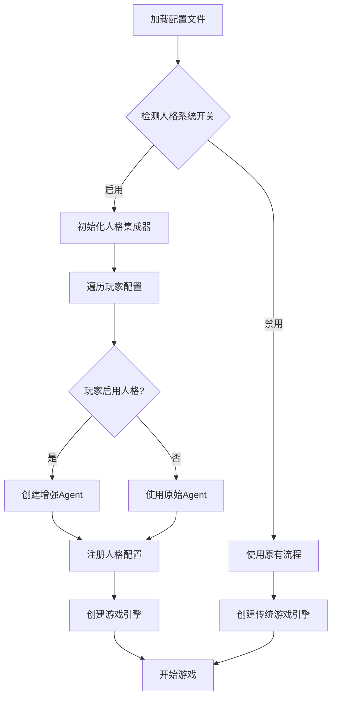
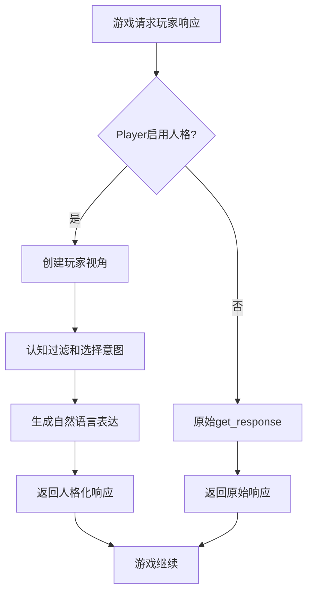

# 🔧 人格系统集成指南

## 📋 集成概览

本指南说明如何将人格系统集成到现有的LLM Werewolf项目中，确保**最小改动**和**向后兼容**。

## 🎯 集成策略

### 核心原则
1. **零破坏性** - 现有代码完全不变
2. **渐进式** - 通过配置开关控制
3. **装饰器模式** - 不修改核心逻辑
4. **向下兼容** - 所有人格功能都是可选的

---

## 📁 需要修改的文件（最小集）

### 1. 配置系统扩展
```bash
src/llm_werewolf/core/config/player_config.py  # ✅ 已修改
```
- 添加人格相关配置参数
- 向后兼容，不影响现有配置

### 2. Agent接口增强
```bash
src/llm_werewolf/core/player.py              # ✅ 已修改
src/llm_werewolf/core/engine/base.py         # ✅ 已修改
```
- 添加人格系统支持
- 保持原有接口

### 3. 主程序集成
```bash
src/llm_werewolf/cli.py                       # ✅ 已修改
```
- 添加人格系统检测和初始化

---

## 🚀 使用方法

### 方法1：配置文件方式（推荐）

1. **创建带人格的配置文件**
```yaml
# configs/personality_game.yaml
language: zh-TW
enable_personality_system: true  # 全局开关

players:
  - name: 激进狼人
    model: gpt-4
    base_url: https://api.openai.com/v1
    api_key_env: OPENAI_API_KEY
    personality_profile: aggressive_wolf      # 🆕
    enable_personality_system: true           # 🆕

  - name: 传统AI
    model: gpt-4
    base_url: https://api.openai.com/v1
    api_key_env: OPENAI_API_KEY
    # 不启用人格系统，保持原有行为

  - name: 谨慎预言家
    model: claude-3-sonnet
    base_url: https://api.anthropic.com/v1
    api_key_env: ANTHROPIC_API_KEY
    personality_profile: cautious_seer        # 🆕
    enable_personality_system: true           # 🆕
```

2. **运行游戏**
```bash
# 使用带人格系统的配置
uv run llm-werewolf configs/personality_game.yaml

# 仍然可以运行原有配置（完全不变）
uv run llm-werewolf configs/demo.yaml
```

### 方法2：代码方式（高级）

```python
from llm_werewolf.core import GameEngine
from llm_werewolf.core.engine.personality_integration import create_enhanced_engine

# 创建增强版游戏引擎
enhanced_engine = create_enhanced_engine(
    original_engine=game_engine,
    enable_personality=True,
    player_configs=[
        {"player_id": 1, "personality_profile": "aggressive_wolf"},
        # 其他配置...
    ]
)
```

---

## 🔍 实际工作流程

### 启用人格系统的流程



### 游戏中的响应流程



---

## 🎮 具体效果演示

### 普通模式 vs 人格模式对比

| 玩家类型 | 普通模式响应 | 人格模式响应（激进狼人） |
|---------|-------------|-------------------|
| 相同情况怀疑某人 | "我觉得玩家2有点可疑" | "我强烈怀疑玩家2，他行迹可疑，必须立即处理！" |
| 面对压力 | "我需要再看看情况" | "无论压力多大，我都不会动摇我的判断！" |
| 解释想法 | "我认为...因为这样..." | "我的直觉告诉我，这就是事实！" |

---

## 🔧 配置参数说明

### PlayerConfig新参数

| 参数 | 类型 | 默认值 | 说明 |
|------|------|--------|-----|
| `personality_profile` | Optional[str] | None | 人格档案名称 |
| `enable_personality_system` | bool | False | 是否启用人格系统 |
| `force_personality_mode` | bool | False | 强制人格模式 |

### GameConfig新参数

| 参数 | 类型 | 默认值 | 说明 |
|------|------|--------|-----|
| `enable_personality_system` | bool | False | 全局人格系统开关 |

---

## 🧪 测试和验证

### 1. 运行演示脚本
```bash
python scripts/demo_personality_system.py
```

### 2. 运行人格化游戏
```bash
uv run llm-werewolf configs/personality_demo.yaml
```

### 3. 验证向后兼容
```bash
# 原有配置应该完全不变
uv run llm-werewolf configs/demo.yaml
```

---

## 📊 监控和调试

### 获取人格系统状态
```python
# 在游戏引擎中
if hasattr(engine, 'personality_integration'):
    stats = engine.personality_integration.get_system_statistics()
    print(f"人格系统状态: {stats}")

# 获取玩家决策历史
for player_id, agent in engine.personality_integration.enhanced_agents.items():
    history = engine.personality_integration.get_agent_decision_history(player_id)
    print(f"Player {player_id} decisions: {history}")
```

### 日志输出示例
```
✅ Personality system enabled with 3 players
🎭 Player1 using personality: aggressive_wolf
🎭 Player2 using personality: cautious_seer
🎭 Player3 using personality: emotional_witch

Game running with 6 total agents (3 personality-enhanced)
```

---

## 🔄 回滚和兼容性

### 如果出现问题
1. **回退到传统模式**：设置 `enable_personality_system: false`
2. **选择性禁用**：逐个玩家设置 `enable_personality_system: false`

### 完全兼容性保证
- 所有原有配置文件继续有效
- 所有原有API保持不变
- 原有游戏逻辑完全不变

---

## 🎯 下一步扩展

### 即将推出（Phase 2）
- 批量游戏统计
- 人格性能对比
- 学习型人格系统
- 多局竞技功能

---

## 🆘 故障排除

### 常见问题

1. **导入错误**
   ```
   ImportError: cannot import name 'PersonalityEngineIntegration'
   ```
   - 解决：确保所有新模块路径正确
   - 检查Python路径设置

2. **配置错误**
   ```
   ValidationError: personality_profile not found
   ```
   - 解决：检查人格档案名称拼写
   - 确保 `configs/personalities/` 目录存在对应文件

3. **性能问题**
   ```
   Decision timeout exceeded
   ```
   - 解决：调整 `personality_timeout` 配置
   - 检查LLM API响应时间

### 调试模式
```python
# 启用详细日志
import logging
logging.basicConfig(level=logging.DEBUG)
```

---

## ✅ 集成检查清单

- [ ] 配置文件扩展完成
- [ ] Player类修改完成
- [ ] GameEngine集成完成
- [ ] CLI入口集成完成
- [ ] 人格配置文件创建完成
- [ ] 演示脚本运行正常
- [ ] 向后兼容性验证通过
- [ ] 监控统计功能正常

---

**🎉 集成完成后，你将拥有一个功能完整的人格驱动AI狼人杀系统！**